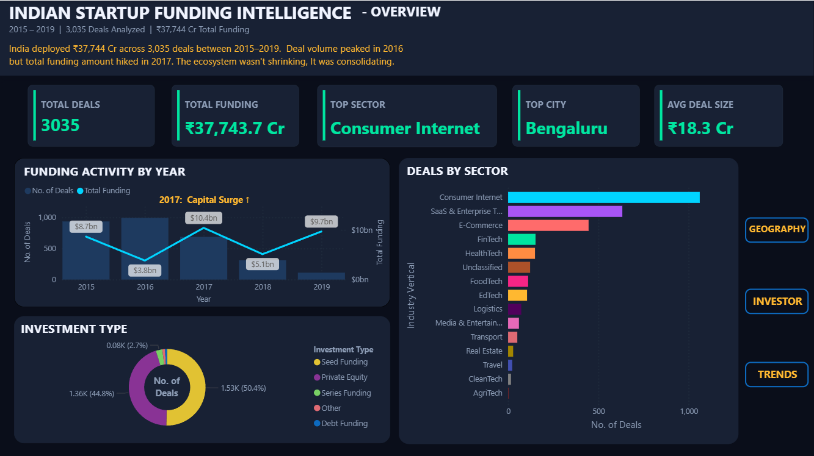
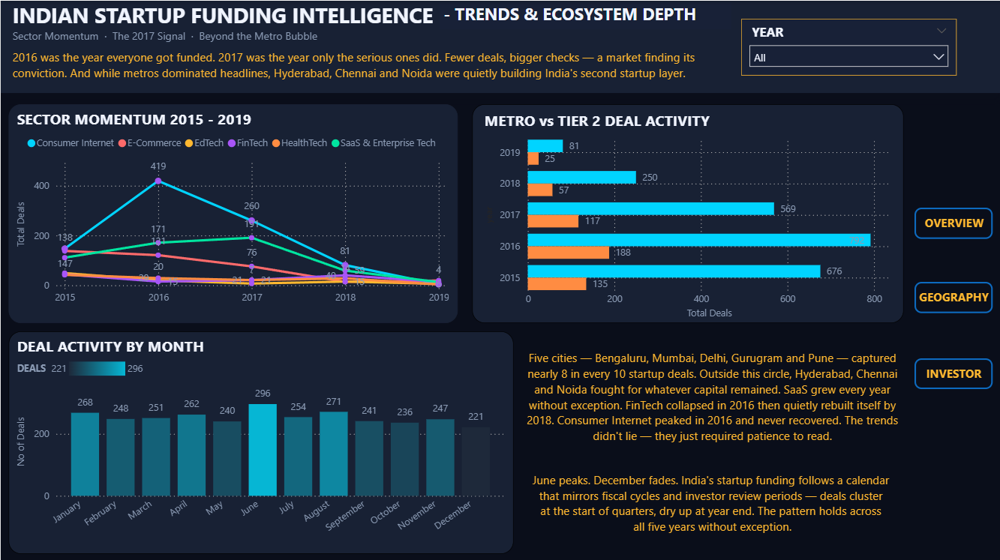
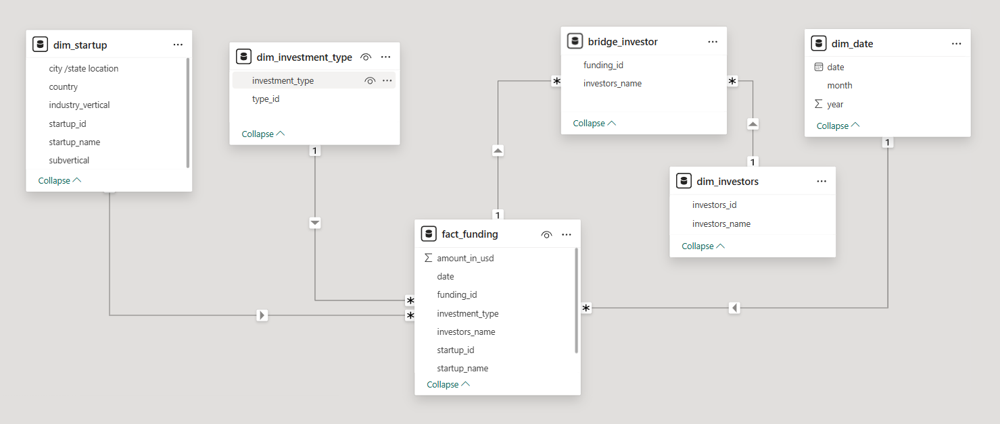

# 📊 Indian Startup Funding Intelligence Dashboard
 
> *"2016 was the year everyone got funded. 2017 was the year only the serious ones did."*
 
A end-to-end Business Intelligence project analyzing **3,035 startup funding deals** across India from 2015 to 2019 — built with Python, SQL, and Power BI using a star schema data model.
 
---
 
## 📊 Live Dashboard Preview
 


 
> **4-page interactive dashboard** with dark luxury theme, narrative storytelling, and sector-color-coded visuals.
 
---
 
## 🔍 Key Insights Uncovered
 
| Insight | Finding |
|---|---|
| 📅 Peak Deal Year | **2016** — 992 deals, the most active year |
| 💰 Peak Capital Year | **2017** — ₹10,429 Cr deployed despite 31% fewer deals |
| 📉 Market Signal | Deal count fell 30.7% from 2016→2017, yet capital surged **172.4%** — the market matured |
| 🏙️ Dominant City | **Bengaluru** — 28% of all deals (850 of 3,035) |
| 🌆 Top 3 Cities | Bengaluru + Mumbai + Delhi = **61.8%** of all deals |
| 🏭 Top Sector | **Consumer Internet** — 1,018 deals (33% of total) |
| 👤 Top Investor | **Ratan Tata** — 25 personal investments, more than any single VC firm |
| 🌱 Funding Stage | Seed Funding dominates at **50.4%** of all deals |
 
---
 
## 🗂️ Project Structure
 
```
indian-startup-funding-dashboard/
│
├── data/
│   └── startup_funding_raw.csv          ← Original untouched dataset
│   └── startup_funding_cleaned.csv     ← After Excel cleaning
│   └── startup_funding_final.csv     ← Final dataset after Python cleaning
│
├── notebooks/
│   └── EDA_Indian_Startup_Funding.ipynb            ← Full cleaning + EDA notebook
│
├── dashboard/
│   └── Indian_Startup_Funding_Dashboard.pbix                 ← Power BI dashboard file
│
├── assets/
│   ├── page1_overview.png              ← Live
│   ├── page2_geography.png             ← Coming soon
│   ├── page3_investors.png             ← Coming soon
│   └── page4_trends.png                ← Coming soon
│
└── README.md
```
 
---
 
## 🛠️ Tech Stack
 
| Tool | Purpose |
|---|---|
| **Python + Pandas** | Data cleaning, EDA, star schema export |
| **Microsoft Excel** | Initial pre-processing and visual inspection |
| **Power BI Desktop** | Dashboard, star schema, DAX measures, data modeling |
| **DAX** | Custom measures — YoY growth, funding in Crores, top N logic |
 
---
 
## 🏗️ Data Architecture — Star Schema
 


 
**Why star schema?** Separates measures (amounts, deal counts) from descriptive context (sector, city, investor) — enabling fast aggregations in Power BI and clean DAX measure writing.
 
---
 
## 🧹 Data Cleaning Process
 
### Stage 1 — Excel Pre-processing
- Renamed all columns to consistent snake_case
- Replaced string nulls (`"nan"`, `"N/A"`, `"unknown"`) with true blank cells
- Standardized city names — `Bangalore → Bengaluru`, `Gurgaon → Gurugram`
- Fixed slash-separated multi-location values — `"Bengaluru / USA" → "Bengaluru"`
- Added `country` column for international startup identification
### Stage 2 — Python / Pandas (Jupyter Notebook)
- **823 unique industry values** collapsed into **15 meaningful sectors** using keyword-based classification
- Fixed **110 startup name duplicates** — `"MamaEarth"`, `"Mamaearth"`, `"mamaearth"` → `"Mamaearth"` using most-frequent-variant logic
- Parsed date strings to datetime — extracted year, month, quarter
- Converted amount column from string to float — removed comma formatting, retained nulls as `NaN` (970 rows had genuinely undisclosed amounts)
- Filled categorical nulls: `industry_vertical → "Unclassified"`, `city → "Unknown"`, `investors_name → "Unknown"`
- Dropped irrelevant columns:  `remarks`
**Raw → Cleaned:**
 
| Metric | Raw | Cleaned |
|---|---|---|
| Unique sectors | 823 | 15 |
| Unique startup names | 2,449 | 2,339 |
| String nulls in amount | Mixed | True NaN |
| Column names | Inconsistent | snake_case |
 
---
 
## 📈 Dashboard Pages
 
### Page 1 — Overview: The Big Picture
*"India deployed ₹3,813 Cr across 3,035 deals between 2015–2019. Deal volume peaked in 2016 — but capital kept rising. The ecosystem wasn't shrinking. It was consolidating."*
 
- 5 KPI cards — Total Deals, Total Funding, Avg Deal Size, Top City, Top Sector
- Combo chart — Deal count (bars) vs Total Funding (line) by year
- Horizontal bar — Deals by sector with sector-specific colors
- Donut chart — Investment type breakdown
---
 
### Page 2 — Geography: Where India Builds
*"Three cities built modern India — but they built different things. Bengaluru won technology. Mumbai held finance. Delhi fuelled commerce."*
 
- City ranking horizontal bar — Top 8 cities by deal count
- Stacked bar — Sector composition per city (reveals each city's identity)
- Year slicer — filter geography by year
---
 
### Page 3 — Investors: Follow the Money
*"Behind every funded startup is a decision maker. Ratan Tata personally backed more companies than any VC firm in this dataset."*
 
- Top investors bar chart — ranked by deal count
- Funding stage funnel — Seed → Series A → B → C → D+
- KPI cards — Active investor count, Avg deal size (known investors)
---
 
### Page 4 — Trends: The Story Over Time
*"2016 was the year everyone got funded. 2017 was the year only the serious ones did. Fewer deals, more money — the market had grown up."*
 
- Multi-line sector momentum chart — top 6 sectors over years
- Monthly deal pattern — which months see peak activity
- Divergence chart — Deal count vs Capital deployed (the 2017 story)
---
 
## 📐 DAX Measures
 
```dax
-- Total deals
TOTAL DEALS = COUNT(fact_funding[funding_id])
 
-- Total funding converted to Crores
TOTAL FUNDING = 
FORMAT(
    DIVIDE(SUM(fact_funding[amount_in_usd]), 10000000),
    "₹#,##0.0 Cr"
)
 
-- Average deal size in Crores
AVG DEAL SIZE = 
FORMAT(
    DIVIDE(
        AVERAGE(fact_funding[amount_in_usd]),
        10000000
    ),
    "₹#,##0.0 Cr"
)
 
-- YoY deal growth
YoY Deal Growth = 
VAR CurrentYear = CALCULATE(COUNT(fact_funding[funding_id]))
VAR PrevYear = 
    CALCULATE(
        COUNT(fact_funding[funding_id]),
        SAMEPERIODLASTYEAR(dim_date[date])
    )
RETURN DIVIDE(CurrentYear - PrevYear, PrevYear)
 
-- Top city by deal count
TOP CITY = 
FIRSTNONBLANK(
    TOPN(
        1,
        VALUES(dim_startup[city /state location]),
        CALCULATE(COUNT(fact_funding[funding_id])),
        DESC
    ),
    1
)
 
-- Top sector by deal count
TOP SECTOR = 
FIRSTNONBLANK(
    TOPN(
        1,
        VALUES(dim_startup[industry_vertical]),
        CALCULATE(COUNT(fact_funding[funding_id])),
        DESC
    ),
    1
)
```
 
---
 
## 🎨 Design System
 
**Theme:** Dark luxury intelligence — Bloomberg terminal meets premium fintech
 
| Element | Hex |
|---|---|
| Page background | `#0A0E1A` |
| Card background | `#111827` |
| Primary text | `#F0F4FF` |
| Secondary text | `#8B9BB4` |
| Primary accent | `#00D4FF` |
| Growth / positive | `#00E5A0` |
| Decline / negative | `#FF6B6B` |
| Gold / top rank | `#FFB830` |
| Investor / VC | `#A855F7` |
 
---
 
## 📦 Dataset
 
- **Source:** [Kaggle — Indian Startup Funding](https://www.kaggle.com/datasets/sudalairajkumar/indian-startup-funding)
- **Original size:** 3,035 rows × 11 columns
- **Coverage:** January 2015 – December 2019
- **Compiled from:** Inc42, Crunchbase, and startup news sources
---
 
## 🚀 How to Run
 
### View the Dashboard
1. Download `dashboard/startup_funding.pbix`
2. Open with [Power BI Desktop](https://powerbi.microsoft.com/desktop/) (free)
3. Data is embedded — no connection setup needed
### Run the Cleaning Notebook
```bash
git clone https://github.com/abhinavyadav23/indian-startup-funding-dashboard
cd indian-startup-funding-dashboard
pip install pandas jupyter
jupyter notebook notebooks/01_cleaning_and_eda.ipynb
```
 
---
 
## 💡 What I Learned
 
- **Star schema design** separates concerns cleanly — dimensions describe, facts measure. This makes DAX measures significantly simpler to write.
- **Keyword-based sector classification** at scale (823 → 15 categories) requires ordering rules carefully — more specific keywords must be checked before broader ones to avoid misclassification.
- **Narrative-first dashboard design** — deciding the story before building visuals ensures every chart earns its place. Three visuals that prove a story beat ten visuals that just display data.
- **The 2017 divergence** was the most interesting finding — a market correction that was actually healthy. Fewer deals, larger checks = investors becoming more selective, not more fearful.
---
 
## 👤 Author
 
**Abhinav Yadav**
Data Analyst | Business Intelligence Analyst
NIT Jalandhar | Class of 2027
 
[](https://linkedin.com/in/abhinavyadav23)
[](https://github.com/abhinavyadav01)
 
---

